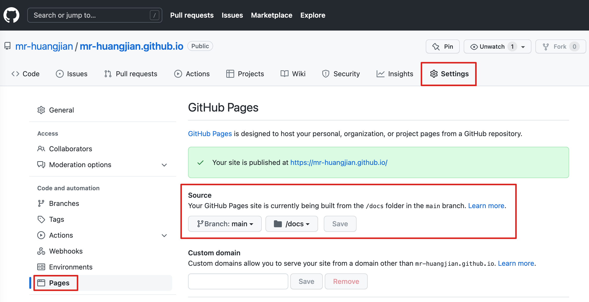

# 介绍
官网 [docsify](https://docsify.js.org/#/zh-cn/)

# 开发环境的部署

1. 安装 homebrew，查看[链接](https://brew.sh/index_zh-cn)
2. 安装 node，执行命令 `brew install node`
3. 安装 docsify，执行命令 `npm i docsify-cli -g`

# 开发

[快速入门](https://docsify.js.org/#/zh-cn/quickstart)

# 部署到 Github Page

1. 在 Github 新建项目，名为 `{username}.github.io`
2. 在 Setting 的 General 中，找到 Github Page
3. 在 source 选择 main/master 分支的 docs 目录，并保存
4. 上传代码，等几分钟就可以访问

# 参考
- [homebrew 换源](https://www.cnblogs.com/iAmSoScArEd/p/12394625.html)
- Hexo
